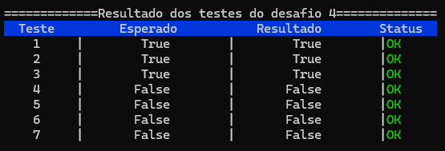
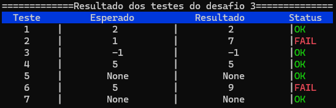
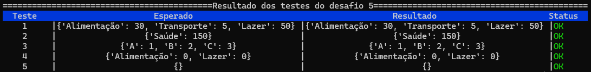

# Desafio Técnico - DataViva

Este repositório contém as soluções para o desafio técnico da vaga de **Bolsa de Pesquisa** no DataViva.

## 📁 Estrutura do Projeto

O projeto foi organizado do seguinte modo:

```text
├── assets/             # Contem as imagens do terminal
├── desafios/           # Contém as funções de resolução dos problemas
│   ├── desafio1.py     # FizzBuzz
│   ├── desafio2.py     # Palíndromo
│   ├── desafio3.py     # Duplicados
│   ├── desafio4.py     # Validação de Parênteses
│   └── desafio5.py     # Manipulação de Dados
│
├── testes/             # Contém os scripts de teste
│   ├── utils_teste.py  # Utilitário genérico para rodar e formatar os testes
│   ├── teste_desafio2.py
│   └── ...
│
└── main_testes.py      # Script principal para executar todos os testes de uma vez

```
## Desafios Resolvidos

### 1. O Clássico FizzBuzz
Programa que imprime números de 1 a 100, substituindo múltiplos de 3 por `Fizz`, de 5 por `Buzz` e de ambos por `FizzBuzz`.

### 2. Verificador de Palíndromo
Função que verifica se uma palavra ou frase é um palíndromo, ignorando espaços e hífens.
* **Exemplos:** `"arara"` (true), `"ovo"` (true), `"casa"` (false).

### 3. Encontrar Duplicados
Identifica o primeiro número duplicado em uma lista de inteiros
* **Entrada:** `[1, 2, 3, 4, 2, 5]` ➝ **Saída Esperada:** `2`

### 4. Validação de Parênteses
Utiliza uma **Pilha (Stack)** para verificar se uma string de parênteses, colchetes e chaves está bem formada.

Exemplos: `{[()]}` (Válido), `{[(])}` (Inválido).

### 5. Manipulação de Dados
Algoritmo que recebe uma lista de transações e agrupa a soma dos valores por categoria.

## ▶️ Como Executar

Certifique-se de ter o **Python 3** instalado e rode os seguintes comandos na raiz do projeto.

*Foi criado um **test runner** customizado que exibe os resultados em uma tabela colorida no terminal.*

1. Executar o FizzBuzz (Desafio 1):
```bash
python3 desafios/desafio1.py
```

2. Executar um teste de um desafio especifico (ex: `desafio5`)

```bash
python3 -m testes.teste_desafio5
```

3. Executar todos os testes automatizados dos desafios 2, 3, 4 e 5

```bash
python3 main_testes.py
```

**Exemplos de saida:**







